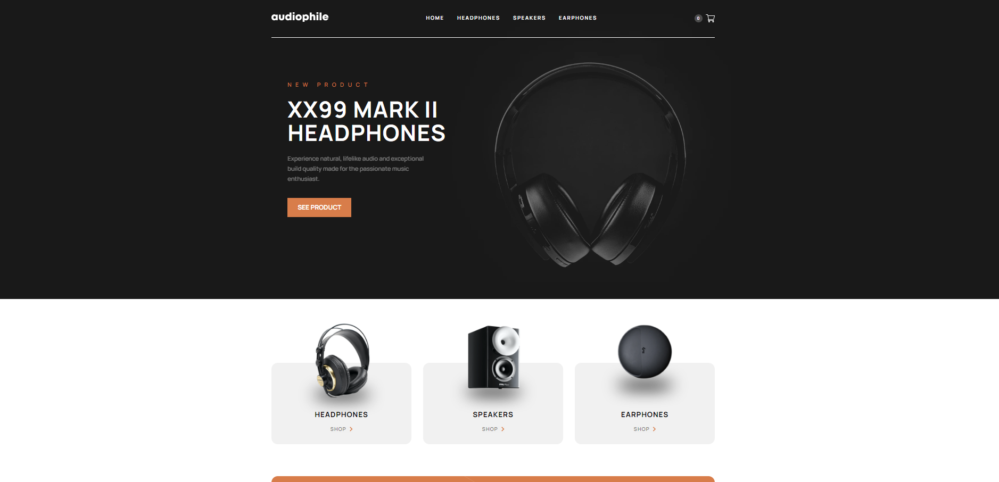

Markdown
# Audiophile E-Commerce Platform

 
 
 

## Project Summary

The Audiophile e-commerce platform is a full-stack web application designed to provide a seamless online shopping experience for high-end audio equipment. The platform caters to audiophiles and music enthusiasts looking for quality headphones, speakers, earphones, and accessories. It combines a React.js frontend with an Express.js and Node.js backend and a MongoDB database for data storage.

## Key Features and Their Purposes

* **Responsive Web Design (React.js):** Ensures a user-friendly experience across various devices and screen sizes.
* **Dynamic Product Catalogue (MongoDB):** Enables easy updating and management of product listings.
* **Interactive Shopping Cart (Redux):** Allows users to add, remove, and adjust quantities of items, enhancing the shopping experience.
* **Secure Payment Processing (Stripe):** Ensures secure and reliable transactions.
* **User Navigation and Routing (React Router):**  Provides smooth transitions between different pages and components.
* **Order Completion and Management:** Enhances user trust and satisfaction by providing feedback and order details upon successful purchase. 
* **Adaptive Images and Content:** Improves load times and optimizes the display for different devices.
* **Environment Variable Management (.env):** Increases security by keeping sensitive data like database credentials and API keys out of the source code.

## Why These Features Are Used

These features create a robust, secure, and user-friendly e-commerce platform. Responsive design ensures accessibility across devices, dynamic content management allows for easy updates and scalability, secure payment processing is crucial for trust and legality, and interactive UI elements enhance the overall user experience. The use of modern web technologies like React.js, Node.js, Express.js, MongoDB, and Redux supports the application's performance, security, and scalability.

## Screenshots

## Link to Demo: 

